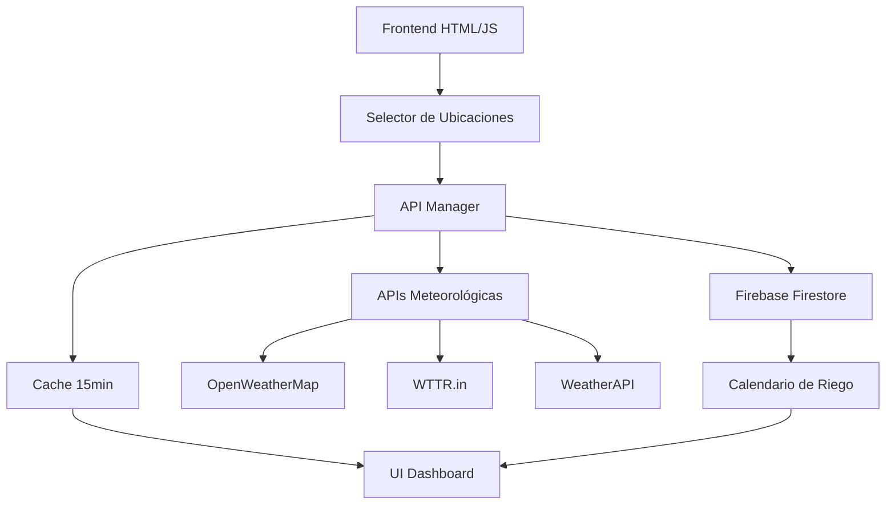

# 🌺 Sistema de Monitoreo de Orquídeas

> Sistema completo de gestión y monitoreo para orquídeas con integración Firebase, APIs meteorológicas y evaluación climática especializada.

[](https://firebase.google.com/)
[](https://developer.mozilla.org/en-US/docs/Web/JavaScript)
[](https://developer.mozilla.org/en-US/docs/Web/HTML)
[](https://materializecss.com/)
[](LICENSE)

---

## 🎯 Descripción

Sistema integral para el cuidado de orquídeas que combina **datos meteorológicos reales** de múltiples ubicaciones geográficas con un **sistema de gestión de riego** almacenado en Firebase. Incluye evaluación especializada de adecuación climática para diferentes especies de orquídeas.

### 🌟 **Funcionalidades Destacadas:**
- **📊 Dashboard en tiempo real** con datos de 9 ubicaciones (Colombia, Chile, Patagonia)
- **🌍 Evaluación climática especializada** para cultivo de orquídeas
- **📅 Calendario inteligente de riego** con almacenamiento en Firebase
- **🔄 Auto-actualización** cada 2 minutos con cache inteligente
- **📱 Diseño completamente responsivo** para móviles y desktop

---

## ⚡ Inicio Rápido

### 1️⃣ **Configurar Firebase (5 minutos)**
```bash
# 1. Ve a https://console.firebase.google.com/
# 2. Crea proyecto: "sistema-orquideas"
# 3. Configura Firestore en modo prueba
# 4. Copia tu configuración a firebaseConfig.ejemplo.js
```

### 2️⃣ **Ejecutar la aplicación**
```bash
# Opción 1: Directamente en navegador
# Abrir: public/inicio.html

# Opción 2: Servidor local (recomendado)
python -m http.server 8000
# Ir a: http://localhost:8000/public/inicio.html
```

### 3️⃣ **Probar funcionalidades**
- **Dashboard:** Ver datos climáticos de diferentes ubicaciones
- **Selector:** Cambiar entre Colombia, Chile y Patagonia
- **Calendario:** Programar riegos y ver eventos almacenados en Firebase

---

## 🏗️ Arquitectura del Sistema



### **🔧 Componentes Principales:**

| Componente | Tecnología | Función |
|------------|------------|---------|
| **Frontend** | HTML5 + Materialize CSS | Interface responsiva |
| **Backend** | Firebase Firestore | Base de datos NoSQL |
| **APIs** | OpenWeather, WTTR.in, WeatherAPI | Datos meteorológicos reales |
| **Cache** | JavaScript LocalStorage | Optimización de rendimiento |
| **Gráficos** | Chart.js | Visualización de datos históricos |

---

## 🌍 Ubicaciones y Evaluación Climática

### **🇨🇴 Colombia - Ideal para Orquídeas**
- **🌸 Medellín** - Tropical montano (Muy Alta adecuación)
- **🏔️ Bogotá** - Tropical de altura (Alta adecuación)
- **☀️ Cali** - Tropical seco (Media-Alta adecuación)

### **🇨🇱 Chile - Clima Templado**
- **🏙️ Santiago** - Mediterráneo (Media adecuación)
- **🌊 Valparaíso** - Mediterráneo costero (Media adecuación)
- **🌧️ Concepción** - Oceánico (Media-Baja adecuación)
- **❄️ Puerto Montt** - Oceánico templado (Baja adecuación)

### **🥶 Patagonia - Climas Extremos**
- **🌬️ Punta Arenas** - Subpolar (Muy Baja adecuación)
- **🧊 Ushuaia** - Subantártico (Muy Baja adecuación)

---

## 🚀 Stack Tecnológico

### **Frontend**
- **HTML5** - Estructura semántica
- **JavaScript ES6+** - Lógica de aplicación y APIs
- **Materialize CSS** - Framework de diseño Material Design
- **Chart.js** - Gráficos interactivos y responsivos

### **Backend & APIs**
- **Firebase Firestore** - Base de datos NoSQL en tiempo real
- **Firebase Functions** - Funciones serverless (Node.js)
- **Firebase Hosting** - Hosting y despliegue
- **Multiple Weather APIs** - Datos meteorológicos redundantes

### **Integraciones**
```javascript
// APIs meteorológicas integradas
const WEATHER_APIS = {
    openweather: "OpenWeatherMap API",
    wttr: "WTTR.in Weather Service", 
    weatherapi: "WeatherAPI.com"
};

// Operaciones Firebase
const FIREBASE_OPS = {
    create: "Programar nuevos riegos",
    read: "Obtener eventos programados",
    update: "Modificar riegos existentes", 
    delete: "Eliminar eventos"
};
```

---

## 📁 Estructura del Proyecto

```
Sistema-de-Orquideas/
├── 📄 README_INTEGRACION.md      # 📖 Documentación completa Firebase & APIs
├── 📄 INTEGRATION_QUICKREF.md   # ⚡ Referencia rápida para desarrolladores
├── 📄 firebaseConfig.ejemplo.js # 🔧 Plantilla de configuración Firebase
├── 📁 public/
│   ├── 🏠 inicio.html           # Landing page con navegación
│   ├── 📊 dashboard.html        # Dashboard principal con APIs
│   └── 📅 calendario.html       # Calendario con Firebase CRUD
├── 📁 functions/
│   ├── 📧 index.js             # Firebase Functions (emails)
│   └── 📦 package.json         # Dependencias backend
└── 📁 docs/
    ├── 📖 DOCUMENTACION_COMPLETA.md
    ├── ⚡ CONFIGURACION_RAPIDA.md
    └── 🔧 README_FIREBASE.md
```

---

## 🔥 Características de Firebase

### **Firestore Database**
```javascript
// Estructura de datos para riegos
{
  id: "auto-generated",
  fecha: "2025-11-04",
  hora: "14:30", 
  planta: "Orquídea Cattleya",
  notas: "Riego después de fertilizar",
  timestamp: FirebaseTimestamp,
  estado: "programado"
}
```

### **Firebase Functions**
- **📧 Notificaciones por email** automáticas
- **⏰ Triggers temporales** para recordatorios
- **🔐 Validación de datos** backend
- **📊 Procesamiento de estadísticas**

---

## 🌐 APIs Meteorológicas

### **Sistema de Redundancia**
```javascript
// Orden de prioridad para obtener datos:
1. OpenWeatherMap (API principal)
2. WTTR.in (API alternativa)  
3. WeatherAPI (API complementaria)
4. Datos simulados realistas (fallback)
```

### **Cache Inteligente**
- **⏱️ TTL:** 15 minutos para datos estables
- **💾 LocalStorage:** Persistencia entre sesiones
- **🔄 Auto-refresh:** Actualización automática cada 2 minutos
- **🛡️ Fallback:** Sistema de respaldo robusto

---

## 📚 Documentación

### **📖 Para Desarrolladores**
- **[README_INTEGRACION.md](README_INTEGRACION.md)** - Documentación completa de Firebase y APIs
- **[INTEGRATION_QUICKREF.md](INTEGRATION_QUICKREF.md)** - Referencia rápida técnica

### **⚡ Para Usuarios**
- **[CONFIGURACION_RAPIDA.md](docs/CONFIGURACION_RAPIDA.md)** - Setup en 5 minutos
- **[COMO_ABRIR.md](docs/COMO_ABRIR.md)** - Instrucciones de uso

### **🔧 Configuración Técnica**
- **[README_FIREBASE.md](docs/README_FIREBASE.md)** - Setup detallado de Firebase
- **[CONFIGURACION_EMAIL.md](docs/CONFIGURACION_EMAIL.md)** - Configurar notificaciones

---

## 🎮 Demo en Vivo

### **🌍 Selector de Ubicaciones**


### **📅 Calendario Firebase**


---

## 🔮 Roadmap & Próximas Funcionalidades

### **🚀 Versión 2.0 (Planificada)**
- [ ] **📱 App móvil** con React Native
- [ ] **🔔 Push notifications** para recordatorios
- [ ] **📈 ML predictions** para riego inteligente
- [ ] **👥 Sistema multiusuario** con perfiles
- [ ] **📊 Dashboard administrativo** con analytics

### **🛡️ Mejoras de Seguridad**
- [ ] **🔐 Firebase Auth** con Google/Email
- [ ] **🛡️ Security Rules** para Firestore
- [ ] **🔑 API key management** con variables de entorno
- [ ] **⚡ Rate limiting** para APIs

---

## 🤝 Contribución

¿Quieres contribuir al proyecto? ¡Excelente!

1. **Fork** el repositorio
2. **Crea** una rama para tu feature (`git checkout -b feature/nueva-funcionalidad`)
3. **Commit** tus cambios (`git commit -am 'Agrega nueva funcionalidad'`)
4. **Push** a la rama (`git push origin feature/nueva-funcionalidad`)
5. **Abre** un Pull Request

---

## 👨‍💻 Autor

**Vicente Muñoz** - *Desarrollador Full Stack especializado en IoT*

- 🌐 **GitHub:** [@Vicalex21](https://github.com/Vicalex21)
- 📧 **Email:** Contacto disponible en el perfil de GitHub
- 🏢 **Especialización:** Sistemas IoT para agricultura y jardinería

---

## 📜 Licencia

Este proyecto está bajo la Licencia Académica. Ver el archivo [LICENSE](LICENSE) para más detalles.

---

## 🙏 Agradecimientos

- **Firebase Team** por la excelente plataforma backend
- **Materialize CSS** por el framework de diseño
- **OpenWeatherMap, WTTR.in, WeatherAPI** por los datos meteorológicos
- **Chart.js** por las herramientas de visualización
- **Comunidad de cultivo de orquídeas** por el conocimiento especializado

---

<div align="center">

**🌺 Hecho con ❤️ para la comunidad de orquídeas 🌺**

[⭐ Dale una estrella si te gustó el proyecto](https://github.com/Vicalex21/Sistema-de-Orquideas/stargazers) | [🐛 Reportar un bug](https://github.com/Vicalex21/Sistema-de-Orquideas/issues) | [💡 Sugerir una mejora](https://github.com/Vicalex21/Sistema-de-Orquideas/issues)

</div>